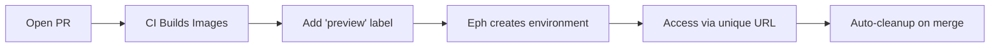
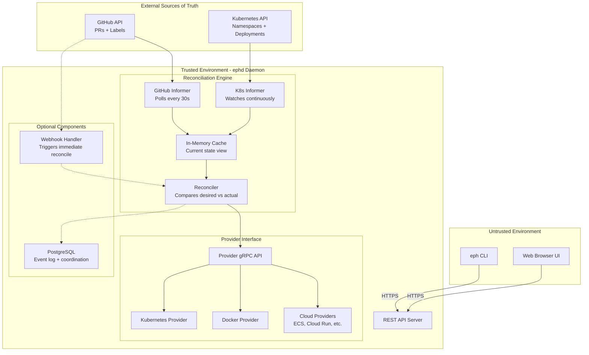

# Eph 🌊

[](https://github.com/ephlabs/eph/actions/workflows/ci.yml)
[](https://go.dev)
[](https://opensource.org/licenses/Apache-2.0)
[](https://github.com/pre-commit/pre-commit)
[](https://grpc.io)
[](https://www.postgresql.org)

> *Ephemeral environments that make you say "What the eph?"*

Eph is an open-source ephemeral environment controller that automatically creates, manages, and destroys temporary preview environments for pull requests. Get a full, isolated environment with every PR - complete with its own URL, database, and resources.

## Vision

```
Developer: *opens PR*
Developer: *adds 'preview' label*
Eph: "Here's your environment: https://myapp-gentle-stream-42.preview.company.com"
Developer: "What the eph? That was fast!"
```

No more fighting over staging servers. No more "works on my machine." Just push code, get a preview.

## How It Works



**Key principles:**
- **Reconciliation-first**: Eph continuously reconciles desired state (PRs with labels) against actual state (running environments)
- **Crash-only design**: No graceful shutdown needed - just restart and reconcile
- **Stateless controller**: External systems (GitHub, Kubernetes) are the source of truth, not internal databases
- Eph orchestrates environments, it doesn't build images (that's CI's job)
- Works with your existing infrastructure (Kubernetes, Docker, cloud providers)
- Extensible via gRPC-based provider plugins
- Secure by default with non-guessable URLs

## Architecture



**Important**: The eph CLI is a pure API client with zero direct access to infrastructure, databases, or providers. All operations flow through the ephd REST API.

## Configuration (Target State)

Projects will configure Eph via `eph.yaml`:

```yaml
version: "1.0"
name: my-app

triggers:
  - type: pr_label
    labels: ["preview"]
    wait_for_checks: ["build"]

environment:
  name_template: "{project}-{words}-{number}"  # my-app-gentle-stream-42
  ttl: 72h
  idle_timeout: 4h

kubernetes:
  manifests:
    - ./k8s/base
    - ./k8s/overlays/preview
  images:
    - name: api
      newTag: "pr-{pr_number}"

database:
  enabled: true
  instances:
    - name: postgres
      version: "15"
      template:
        strategy: seed
        seed:
          scripts: ["./db/schema.sql"]
```

## Current Status

**🚧 Pre-MVP** - Architecture planning complete, implementation starting

## Project Structure

Following idiomatic Go project structure with clear separation between API clients and server logic:

```
eph/
├── go.mod
├── cmd/                    # Binary entry points (thin wrappers only)
│   ├── eph/
│   │   └── main.go        # CLI binary: import internal/cli; cli.Execute()
│   └── ephd/
│       └── main.go        # Daemon binary: import internal/server; server.Run()
├── internal/              # Private application code (compiler enforced)
│   ├── server/            # HTTP server implementation
│   ├── cli/               # CLI command implementation
│   ├── api/               # API client/server shared code
│   ├── config/            # Configuration parsing and validation
│   ├── controller/        # Environment reconciliation logic (stateless)
│   ├── informers/         # GitHub and Kubernetes informers
│   ├── providers/         # Provider implementations
│   │   ├── interface.go   # Provider interface
│   │   └── kubernetes/    # Kubernetes provider
│   ├── state/             # Event logging (not authoritative state)
│   ├── webhook/           # Git webhook handlers
│   └── worker/            # Background reconciliation loops
├── pkg/                   # Exportable packages (use sparingly)
│   └── version/           # Version information
├── web/                   # React dashboard
├── api/                   # API definitions and documentation
│   ├── openapi.yaml       # OpenAPI specification
│   └── schemas/           # JSON schemas
└── docs/                  # Documentation
```

### Package Responsibilities

- **`cmd/` packages**: Minimal main functions that import and invoke `internal/` code
- **`internal/` packages**: All business logic, fully testable, shared between binaries
- **`pkg/` packages**: Exportable packages safe for external use (use sparingly)

This structure ensures:
- Clear separation between CLI client and server daemon
- All business logic is testable
- `internal/` prevents external dependencies on private code
- Follows Go community standards
- **Stateless controller pattern**: The controller package contains no authoritative state - it only reconciles external state from GitHub and Kubernetes

## Roadmap

### MVP (Current Focus)
- [ ] Core event processing engine
- [ ] Kubernetes provider (built-in)
- [ ] GitHub webhook integration
- [ ] PostgreSQL state management
- [ ] Basic CLI (`eph list`, `eph logs`, `eph down`)
- [ ] Minimal web dashboard

### Phase 1: Production Ready
- [ ] gRPC provider plugin system
- [ ] GitLab support
- [ ] OAuth/OIDC authentication
- [ ] Helm chart support
- [ ] Prometheus metrics

### Phase 2: Multi-Provider
- [ ] Docker Compose provider
- [ ] AWS ECS provider
- [ ] Google Cloud Run provider
- [ ] Provider plugin SDK

### Future Vision
- [ ] Header-based routing (Signadot-style)
- [ ] Intelligent resource optimization
- [ ] Multi-cluster support
- [ ] IDE integrations

## Technical Decisions

- **Reconciliation-first architecture** - Continuous state reconciliation inspired by Kubernetes controllers
  - Level-based primary: Poll external sources every 30s for eventual consistency
  - Edge-based optimization: Webhooks trigger immediate reconciliation but aren't required
  - No internal source of truth: GitHub defines what should exist, providers report what does exist
- **PostgreSQL as event log** (not authoritative state) - Audit trails, coordination, metrics only
  - System continues working if PostgreSQL is down
  - External systems (GitHub, Kubernetes) are always authoritative
- **gRPC** for provider plugins - Language agnostic, streaming support, process isolation
- **Crash-only design** - No graceful shutdown needed, recovery is just normal startup
- **Kubernetes-first** - Most complex target, proves the provider abstraction
- **Zero-trust client model** - CLI is pure API client, all logic in ephd daemon

## Development & CI

### Prerequisites
- Go 1.24.3+
- PostgreSQL 16+
- golangci-lint (for linting)
- pre-commit (for local development hooks)

### Setting Up Local Development
1. Clone the repository
2. Run the CI setup script:
   ```bash
   ./scripts/setup-ci.sh
   ```
   This installs required tools and sets up pre-commit hooks.

### CI/CD Pipeline
Our continuous integration runs on every push to `main` and all pull requests:

- **Linting**: golangci-lint with comprehensive rules
- **Testing**: Unit tests with PostgreSQL integration
- **Building**: Cross-platform binaries for all major platforms
- **Security Scanning**: Trivy vulnerability scanner and gosec
- **Integration Tests**: End-to-end testing with ephd daemon

#### Branch Protection
The `main` branch is protected and requires:
- All status checks to pass
- One approved review
- Branches to be up to date before merging

#### Pre-commit Hooks
Local pre-commit hooks run automatically before each commit:
- `go-fmt` - Format Go code
- `go-imports` - Organize imports (with local package preference)
- `go-mod-tidy` - Clean up module dependencies
- `go-vet-mod` - Run Go vet on entire module
- `golangci-lint-mod` - Run comprehensive linting on entire module
- `go-test-mod` - Run short tests (30s timeout)
- `trailing-whitespace` - Remove trailing whitespace
- `end-of-file-fixer` - Ensure files end with newline
- `check-yaml` - Validate YAML syntax
- `check-added-large-files` - Prevent large file commits
- `check-merge-conflict` - Detect merge conflict markers

To run manually: `pre-commit run --all-files`

### Commands
```bash
# Run tests
go test ./...

# Test specific packages
go test ./internal/server/
go test ./internal/cli/

# Run linting
golangci-lint run

# Build binaries
go build -o bin/eph ./cmd/eph
go build -o bin/ephd ./cmd/ephd
```

## Getting Started

See [docs/architecture-plan.md](docs/architecture-plan.md) for the complete architectural vision.

---

*When in doubt, just eph it!* 🚀
