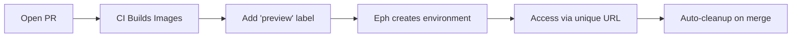
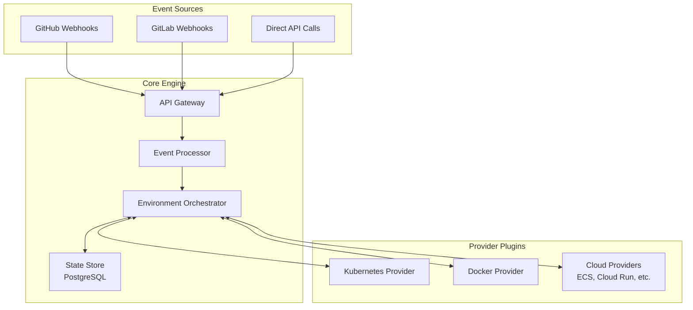

# Eph 🌊

> *Ephemeral environments that make you say "What the eph?"*

Eph is an open-source ephemeral environment controller that automatically creates, manages, and destroys temporary preview environments for pull requests. Get a full, isolated environment with every PR - complete with its own URL, database, and resources.

## Vision

```
Developer: *opens PR*
Developer: *adds 'preview' label*
Eph: "Here's your environment: https://myapp-gentle-stream-42.preview.company.com"
Developer: "What the eph? That was fast!"
```

No more fighting over staging servers. No more "works on my machine." Just push code, get a preview.

## How It Works



**Key principles:**
- Eph orchestrates environments, it doesn't build images (that's CI's job)
- Works with your existing infrastructure (Kubernetes, Docker, cloud providers)
- Extensible via gRPC-based provider plugins
- Secure by default with non-guessable URLs

## Architecture



## Configuration (Target State)

Projects will configure Eph via `eph.yaml`:

```yaml
version: "1.0"
name: my-app

triggers:
  - type: pr_label
    labels: ["preview"]
    wait_for_checks: ["build"]

environment:
  name_template: "{project}-{words}-{number}"  # my-app-gentle-stream-42
  ttl: 72h
  idle_timeout: 4h

kubernetes:
  manifests:
    - ./k8s/base
    - ./k8s/overlays/preview
  images:
    - name: api
      newTag: "pr-{pr_number}"

database:
  enabled: true
  instances:
    - name: postgres
      version: "15"
      template:
        strategy: seed
        seed:
          scripts: ["./db/schema.sql"]
```

## Current Status

**🚧 Pre-MVP** - Architecture planning complete, implementation starting

## Roadmap

### MVP (Current Focus)
- [ ] Core event processing engine
- [ ] Kubernetes provider (built-in)
- [ ] GitHub webhook integration
- [ ] PostgreSQL state management
- [ ] Basic CLI (`eph list`, `eph logs`, `eph down`)
- [ ] Minimal web dashboard

### Phase 1: Production Ready
- [ ] gRPC provider plugin system
- [ ] GitLab support
- [ ] OAuth/OIDC authentication
- [ ] Helm chart support
- [ ] Prometheus metrics

### Phase 2: Multi-Provider
- [ ] Docker Compose provider
- [ ] AWS ECS provider
- [ ] Google Cloud Run provider
- [ ] Provider plugin SDK

### Future Vision
- [ ] Header-based routing (Signadot-style)
- [ ] Intelligent resource optimization
- [ ] Multi-cluster support
- [ ] IDE integrations

## Technical Decisions

- **PostgreSQL** for state (not etcd/Redis) - ACID guarantees, JSON support, single dependency
- **gRPC** for provider plugins - Language agnostic, streaming support, process isolation
- **Event-driven** architecture - Scalable, resilient, auditable
- **Kubernetes-first** - Most complex target, proves the provider abstraction

## Project Structure

```
eph/
├── cmd/
│   ├── eph/          # CLI commands
│   └── ephd/         # Server daemon
├── pkg/
│   ├── api/          # HTTP API handlers
│   ├── controller/   # Environment orchestration
│   ├── providers/    # Provider implementations
│   ├── state/        # PostgreSQL state management
│   └── webhook/      # Git webhook handlers
├── web/              # React dashboard
└── docs/             # Documentation
```

## Getting Started

See [docs/architecture-plan.md](docs/architecture-plan.md) for the complete architectural vision.

---

*When in doubt, just eph it!* 🚀
