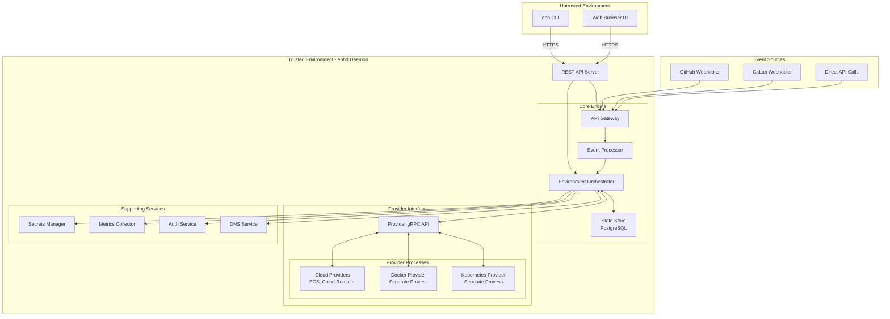
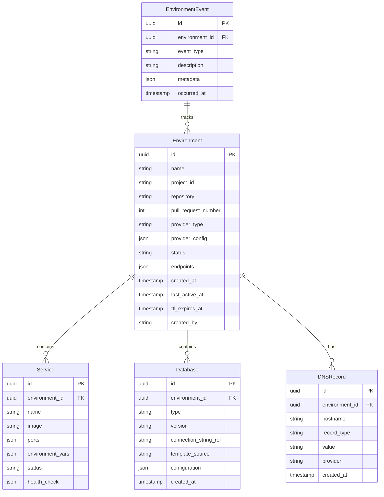
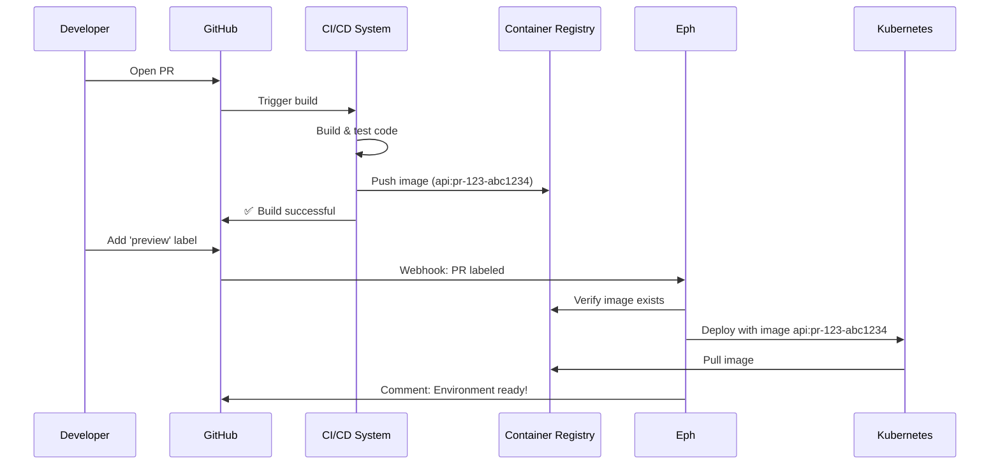
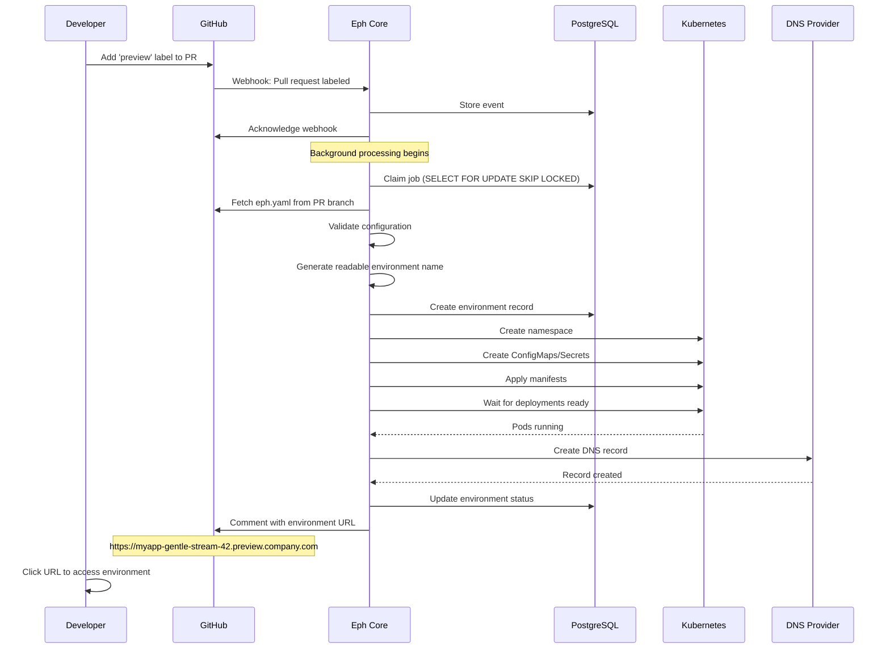

# Eph - Open Source Ephemeral Environment Controller Architecture Plan
*Ephemeral environments that make you say "What the eph?"*

## Executive Summary

Eph is an open-source ephemeral environment controller designed to automatically create, manage, and destroy temporary development and testing environments. The system responds to pull request events from Git providers, provisions isolated environments with their own compute resources and databases, and provides developers with unique URLs to preview their changes before merging.

The architecture emphasizes extensibility through a provider-agnostic plugin system, allowing deployment to diverse infrastructure backends including Kubernetes, Docker Compose, AWS ECS, and more. The design prioritizes developer experience with a simple CLI, automatic resource optimization, and flexible routing strategies.

Eph focuses exclusively on cloud-based ephemeral environments tied to pull requests, working with existing infrastructure rather than provisioning it. It orchestrates the deployment of pre-built container images - it is not a CI/CD system and does not build images. Local development workflows remain the domain of existing tools like Docker Compose.

## Non-Goals and Scope Boundaries

To maintain focus and avoid duplicating existing tools, Eph explicitly does not aim to:

**Replace local development tools**: Eph is not a substitute for Docker Compose, Air, or other local development workflows. Developers should continue using their preferred local tools.

**Build container images**: Eph is an orchestrator, not a CI/CD pipeline. It expects container images to already exist in a registry. Image building should be handled by your existing CI system (GitHub Actions, GitLab CI, Jenkins, etc.).

**Manage production environments**: Eph is specifically for ephemeral preview/test environments. Production deployments should use proper CD tools like ArgoCD or Flux.

**Provide a PaaS**: Eph manages temporary environments, not long-running applications. It's a developer productivity tool, not an application platform.

**Abstract away all platform differences**: While Eph provides a common interface, it embraces platform-specific features rather than lowest-common-denominator abstractions.

## Core Concepts and Terminology

An **ephemeral environment** is a temporary, isolated instance of an application created automatically for a specific purpose, typically to preview changes in a pull request. These environments include all necessary components: compute resources, databases, networking, and dependencies.

A **provider** in Eph terminology is a plugin that knows how to create and manage environments on a specific infrastructure platform. The Kubernetes provider, for example, creates namespaces and deployments in a Kubernetes cluster, while a Docker Compose provider might spin up containers on a single host or Docker Swarm cluster.

The **environment lifecycle** encompasses creation (triggered by a PR event), active use (developers testing features), idle periods (automatic scaling down), and eventual destruction (when the PR is merged or after a timeout).

## Example Use Cases

Eph excels at scenarios requiring isolated, temporary environments:

**Frontend Preview Deployments**: Every PR gets a unique URL for designers and product managers to review changes without setting up development environments.

**API Testing**: QA engineers test API changes without affecting shared staging environments, eliminating "works on my machine" issues.

**Database Migration Testing**: Safely test schema changes with production-like data without risk to shared databases.

**Multi-Service Integration**: Test microservice changes with the full application stack, ensuring compatibility before merge.

**Customer Demos**: Spin up isolated environments for sales demos with specific feature flags or customizations.

**Training and Workshops**: Create identical environments for each workshop participant without manual setup.

Eph is not designed for:

**Local development workflows**: Use Docker Compose or similar tools for rapid local iteration.

**Production deployments**: Use proper CD tools like ArgoCD, Flux, or Spinnaker.

**Long-running test environments**: Use dedicated staging clusters for persistent testing needs.

**CI/CD build environments**: Use GitHub Actions, Jenkins, or GitLab CI for build and test automation.

## System Architecture Overview

The Eph system follows an event-driven architecture with clear separation of concerns between components. At its heart, the system consists of an API Gateway that receives webhook events from Git providers, an Event Processor that validates and queues these events, and an Environment Orchestrator that coordinates the actual provisioning of resources.

The following diagram illustrates the architecture of Eph, highlighting the separation between the 'Untrusted Environment' and the 'Trusted Environment - ephd Daemon'. The 'Untrusted Environment' includes components like the CLI and Web UI, which interact with the system via HTTPS but do not have direct access to infrastructure or sensitive resources. The 'Trusted Environment - ephd Daemon' encompasses the core engine, provider interface, and supporting services, which handle all privileged operations securely within controlled boundaries.



**Important**: The eph CLI is a pure API client with zero direct access to infrastructure, databases, or providers. All operations flow through the ephd REST API.

### Event Processing Flow

When a developer creates a pull request with the appropriate label (e.g., "preview"), the Git provider sends a webhook to Eph's API Gateway. The Event Processor validates the webhook signature, extracts relevant information, and creates an environment provisioning job. This job enters a queue for processing by the Environment Orchestrator.

The Orchestrator reads the project's `eph.yaml` configuration file from the repository to understand what type of environment to create. It then communicates with the appropriate provider plugin via gRPC to provision the actual resources. Throughout this process, the Orchestrator updates the environment state in PostgreSQL and can send status updates back to the Git provider as PR comments.

## REST API Design

### API-First Architecture

Eph follows an API-first design where the ephd daemon exposes a comprehensive REST API that serves as the **single source of truth** for all operations.

#### Core API Endpoints

**Environment Management**:
- `POST /api/v1/environments` - Create environment
- `GET /api/v1/environments` - List environments  
- `GET /api/v1/environments/{id}` - Get environment details
- `DELETE /api/v1/environments/{id}` - Destroy environment
- `PUT /api/v1/environments/{id}/scale` - Scale environment

**Monitoring and Logs**:
- `GET /api/v1/environments/{id}/status` - Real-time status
- `GET /api/v1/environments/{id}/logs` - Stream logs
- `GET /api/v1/environments/{id}/metrics` - Resource metrics

**Configuration and Auth**:
- `POST /api/v1/auth/login` - Authentication
- `GET /api/v1/config/validate` - Validate eph.yaml
- `GET /api/v1/providers/capabilities` - Available providers

#### API Security
- All endpoints require authentication
- Rate limiting per user/token
- Request/response logging for audit
- Input validation and sanitization
- CORS policies for web dashboard access

### Provider Plugin Architecture

The provider plugin system is the core of Eph's extensibility. Each provider runs as a separate process and communicates with the core system via gRPC. This design offers several advantages over traditional in-process plugins: providers can be written in any language that supports gRPC, they can't crash the core system, and they can be developed and versioned independently.

**Security Note**: Provider plugins run exclusively within the ephd daemon process or as trusted gRPC services. The eph CLI never directly communicates with providers - all provider operations are mediated by the ephd API layer.

The gRPC interface defines a standard set of operations that all providers must implement:

```protobuf
syntax = "proto3";
package eph.provider.v1;

service Provider {
  // Lifecycle Management
  rpc CreateEnvironment(CreateEnvironmentRequest) returns (stream OperationUpdate);
  rpc DestroyEnvironment(DestroyEnvironmentRequest) returns (stream OperationUpdate);
  rpc ScaleEnvironment(ScaleEnvironmentRequest) returns (stream OperationUpdate);
  
  // Status & Monitoring
  rpc GetEnvironmentStatus(GetEnvironmentStatusRequest) returns (EnvironmentStatus);
  rpc StreamLogs(StreamLogsRequest) returns (stream LogEntry);
  rpc GetMetrics(GetMetricsRequest) returns (EnvironmentMetrics);
  
  // Provider Capabilities
  rpc GetCapabilities(Empty) returns (ProviderCapabilities);
  rpc ValidateConfiguration(ValidateConfigurationRequest) returns (ValidationResult);
}

message ProviderCapabilities {
  bool supports_scale_to_zero = 1;
  bool supports_custom_domains = 2;
  bool supports_persistent_storage = 3;
  bool supports_database_provisioning = 4;
  repeated string supported_databases = 5;
  map<string, ConfigSchema> configuration_schema = 6;
  ResourceLimits resource_limits = 7;
}

message OperationUpdate {
  string operation_id = 1;
  OperationStatus status = 2;
  string message = 3;
  int32 progress_percent = 4;
  map<string, string> outputs = 5;
  repeated ResourceInfo created_resources = 6;
}
```

Each provider declares its capabilities when queried, allowing the core system to understand what features are available. For example, a Kubernetes provider might support scale-to-zero and custom domains, while a simpler Docker Compose provider might only support basic environment creation.

### State Management

Eph uses PostgreSQL as its primary state store, chosen for its reliability, ACID compliance, and excellent support for JSON data types. The state store tracks all environments, their current status, configuration, and associated resources.



The state management system handles distributed transactions using the Saga pattern. When creating an environment involves multiple steps (provision compute, create database, configure DNS), each step is tracked independently. If a step fails, compensating actions can be triggered to clean up any partially created resources.

### Security Model

Eph implements security at multiple levels while maintaining developer-friendly defaults.

**API Authentication**: The system uses token-based authentication for all API calls. Developers generate personal access tokens through the web UI, which are then stored securely in their local configuration. Every CLI and API request must include a valid bearer token. The MVP implements simple token validation with basic scoping (read, write, admin), with plans to add OAuth2/OIDC support in later phases.

#### Client Authentication and Authorization

**Token-Based Authentication**: 
- Developers authenticate via personal access tokens or OAuth flows
- Tokens are issued and managed by ephd daemon
- CLI stores tokens locally (encrypted at rest)
- All API requests include Bearer token authentication

**Zero Trust Architecture**:
- CLI clients are considered untrusted and have no privileged access
- All authorization decisions made server-side by ephd
- No sensitive operations can be performed without server validation
- Audit logging captures all API calls with user identity

**Token Management**:
- `eph auth login` - Interactive OAuth or token setup
- `eph auth logout` - Clear local token storage  
- `eph auth status` - Show current authentication state
- Automatic token refresh for long-lived sessions

**URL Enumeration Prevention**: Rather than using predictable URLs like `app-pr-123`, Eph generates human-readable but non-guessable identifiers using a combination of adjectives, nouns, and numbers (e.g., `app-serene-ocean-42`). This approach, inspired by Heroku and similar platforms, prevents unauthorized discovery of environments while remaining memorable and shareable. The system maintains internal mappings between PR numbers and generated names, with optional redirects from PR-based aliases for convenience.

**Environment Access Control**: By default, environments are publicly accessible to support common use cases like sharing preview links with designers, product managers, or external stakeholders. For sensitive environments, developers can enable protection through their `eph.yaml` configuration:
- Basic authentication for simple password protection
- OAuth-based access control (future phase) for organization-based restrictions
- IP allowlisting for additional network-level security

**Audit Logging**: All API actions and environment lifecycle events are logged with user identity, timestamp, action details, and outcome. This provides accountability, aids in debugging, and supports compliance requirements. Logs are structured for easy querying and can be exported to external logging systems.

**Resource Isolation**: Each environment runs in its own Kubernetes namespace with appropriate RBAC policies, network policies, and resource quotas. This ensures environments cannot interfere with each other or exceed their allocated resources.

### Trust Boundary Architecture

Eph operates on a **zero-trust client** model similar to kubectl/Kubernetes or docker/dockerd:

**Trusted Components (ephd daemon)**:
- Runs on trusted infrastructure (cluster, server, cloud)
- Direct database access (PostgreSQL)
- Provider operations (Kubernetes, Docker, etc.)
- Environment orchestration and business logic
- Webhook handling from Git providers
- Secrets and credentials management
- Configuration authority for eph.yaml files

**Untrusted Components (eph CLI)**:
- Runs on developer laptops and workstations
- **Zero database access**
- **Zero direct infrastructure access** 
- **Zero business logic**
- Pure API client that calls ephd REST endpoints
- Local token storage and user preferences only

**Communication**: All client-server communication via authenticated REST API over HTTPS.

## Configuration Schema

Projects define their ephemeral environment requirements in an `eph.yaml` file at the repository root. This file describes triggers, resource requirements, and provider-specific configuration.

#### Configuration Authority

**Server Authority**: The ephd daemon is authoritative for all eph.yaml configurations:
- Validates configuration syntax and permissions
- Applies security policies and resource limits  
- Resolves environment variables and secrets
- Enforces organizational constraints

**Client Role**: The eph CLI may cache configuration for user experience:
- Local preferences and defaults
- Recently used configurations for faster commands
- **Never** authoritative - always defers to server validation

```yaml
version: "1.0"
name: my-application

# Provider configuration with fallback support
providers:
  primary: kubernetes
  fallback: docker-compose

# Trigger configuration
triggers:
  # PR label triggers
  - type: pr_label
    labels: ["preview", "eph:deploy"]
    # Optional: wait for CI to complete
    wait_for_checks: ["build", "test"]
    
  # PR comment triggers  
  - type: pr_comment
    patterns: ["/deploy", "/preview"]
    
  # Automatic triggers for certain branches
  - type: auto
    branches: ["feature/*", "fix/*"]
    ignore_draft: true

# Environment configuration
environment:
  # Naming and networking
  name_template: "{project}-{words}-{number}"  # e.g., "myapp-serene-ocean-42"
  subdomain_template: "{name}.{base_domain}"
  base_domain: "${EPH_BASE_DOMAIN:-preview.example.com}"
  
  # Human-friendly aliases that redirect to the generated name
  alias_template: "{project}-pr-{pr_number}"  # Optional PR-based redirect
  
  # Lifecycle management
  ttl: 72h  # Total time to live
  idle_timeout: 4h  # Scale down after inactivity
  wake_on_access: true  # Auto-wake scaled environments
  
  # Resource constraints
  resources:
    cpu_request: "100m"
    cpu_limit: "2"
    memory_request: "128Mi"
    memory_limit: "4Gi"
    
  # Environment variables available to all services
  env:
    APP_ENV: "preview"
    FEATURE_FLAGS: "preview-mode"
    
# Provider-specific configurations
kubernetes:
  # Target cluster configuration
  context: "${K8S_CONTEXT}"
  namespace_template: "{project}-pr-{pr_number}"
  
  # Manifest sources (applied in order)
  manifests:
    - path: ./k8s/base
    - kustomization: ./k8s/overlays/preview
      patches:
        - target:
            kind: Deployment
            name: api-server
          patch: |
            - op: replace
              path: /spec/replicas
              value: 1
              
  # Image overrides
  images:
    - name: api-server
      newName: "{registry}/{project}/api"
      newTag: "pr-{pr_number}-{commit_sha:0:7}"
      
  # Image pull configuration
  imagePullSecrets:
    - name: registry-credentials
    
  # Common image tag patterns:
  # PR-based: "pr-{pr_number}"
  # Commit-based: "{commit_sha}" or "{commit_sha:0:7}"
  # Combined: "pr-{pr_number}-{commit_sha:0:7}"
  # Branch-based: "{branch_name}-{commit_sha:0:7}"
  #
  # Your CI must push images with these tags BEFORE Eph deploys
      
  # Ingress configuration
  ingress:
    class: nginx
    annotations:
      cert-manager.io/cluster-issuer: letsencrypt-prod
      nginx.ingress.kubernetes.io/proxy-body-size: "10m"
      
docker-compose:
  # Compose file selection
  compose_files:
    - docker-compose.yml
    - docker-compose.preview.yml
    
  # Environment file
  env_file: .env.preview
  
  # Service scaling overrides
  scale:
    web: 1
    worker: 1
  
  # Note: Eph will use the 'image:' directives from your compose files
  # It will NOT execute 'build:' directives - images must exist
  # Your CI should build and push images before triggering Eph
    
# Database configuration
database:
  enabled: true
  
  # Database instances needed
  instances:
    - name: main
      type: postgres
      version: "15"
      
      # Template strategy
      template:
        # Options: "empty", "seed", "snapshot", "branch"
        strategy: seed
        
        # For seed strategy
        seed:
          # SQL scripts to run after creation
          scripts:
            - ./db/schema.sql
            - ./db/migrations/*.sql
            - ./db/seed-preview.sql
            
        # For snapshot strategy (future)
        # snapshot:
        #   source: "${DB_SNAPSHOT_ID}"
        #   max_age: 7d
      
      # Connection configuration
      connection:
        # Environment variable to inject
        env_var: DATABASE_URL
        # Database name (templated)
        database: "app_pr_{pr_number}"
        
# Service dependencies
services:
  # Internal services (Eph manages these)
  - name: redis
    type: internal
    image: redis:7-alpine
    persistent: false
    
  # External services (references to existing systems)
  - name: auth-service
    type: external
    endpoint: "${AUTH_SERVICE_URL:-https://auth.staging.example.com}"
    
# Secrets management
secrets:
  # Provider selection
  provider: kubernetes  # or "vault", "aws-secrets-manager"
  
  # Kubernetes secrets
  kubernetes:
    # Copy secrets from source namespace
    copy_from_namespace: default
    secrets:
      - app-secrets
      - database-credentials
      
  # # Vault configuration (alternative)
  # vault:
  #   path: "secret/data/preview/{environment_name}"
  #   role: "preview-environments"

# Security configuration
security:
  # Environment access control
  environment_access:
    # Default access level for all environments
    default: public  # or "protected"
    
    # Protection for specific environments
    protection:
      # Basic auth (simple password protection)
      type: none  # or "basic", "oauth" (future)
      
      # # For basic auth
      # basic_auth:
      #   username: preview
      #   password: "${PREVIEW_PASSWORD}"
      
      # # For OAuth (future)
      # oauth:
      #   provider: github
      #   allowed_orgs: ["mycompany"]
      #   allowed_teams: ["developers"]
  
  # URL generation strategy
  naming:
    # Use readable random names to prevent enumeration
    strategy: readable  # e.g., "serene-ocean-42"
    include_project: true  # Results in "myapp-serene-ocean-42"
  
# Networking configuration  
networking:
  # Routing strategy
  routing:
    # Options: "subdomain", "path", "header"
    strategy: subdomain
    
    # For path-based routing
    # path_prefix: "/preview/{name}"
    
    # For header-based routing (advanced)
    # header: "X-Eph-Environment"
    
  # TLS configuration
  tls:
    enabled: true
    provider: cert-manager  # or "letsencrypt", "self-signed"
    
# Hooks for custom logic
hooks:
  # Pre-creation hooks (run before environment creation)
  pre_create:
    - name: validate-dependencies
      command: ["./scripts/check-deps.sh"]
      timeout: 30s
      
  # Post-creation hooks (run after environment is ready)
  post_create:
    - name: warm-cache
      command: ["./scripts/warm-cache.sh", "${environment_url}"]
      timeout: 5m
      
    - name: run-smoke-tests
      command: ["./scripts/smoke-test.sh", "${environment_url}"]
      timeout: 10m
      continueOnError: true
      
  # Pre-destroy hooks (run before environment destruction)
  pre_destroy:
    - name: backup-data
      command: ["./scripts/backup-preview-data.sh", "{environment_name}"]
      timeout: 5m
      
# Observability configuration
observability:
  # Metrics collection
  metrics:
    enabled: true
    # Scrape annotations for Prometheus
    annotations:
      prometheus.io/scrape: "true"
      prometheus.io/port: "9090"
      
  # Distributed tracing
  tracing:
    enabled: true
    # Automatic trace context propagation
    propagate_context: true
    
  # Log aggregation
  logs:
    # Log shipping configuration
    ship_to: "${LOG_DESTINATION:-stdout}"
    include_pod_logs: true
    
# Advanced features (optional)
advanced:
  # Multi-region deployment (future)
  # regions:
  #   - us-west-2
  #   - eu-west-1
  
  # Canary deployment support (future)
  # canary:
  #   enabled: true
  #   analysis:
  #     metrics:
  #       - name: error-rate
  #         threshold: 5
```

## The Minimal Viable Product (MVP)

The MVP focuses on delivering a production-ready Kubernetes ephemeral environment controller. This deliberate constraint allows us to build a solid foundation while proving the core architecture.

### MVP Prerequisites

The MVP assumes users have:

**Access to a Kubernetes cluster**: Whether minikube for testing, or a production cluster (EKS, GKE, AKS, etc.)

**A wildcard DNS domain they control**: For example, `*.preview.company.com` pointing to their ingress controller

**A Git repository with Kubernetes manifests**: The application should already be deployable to Kubernetes

**Container images built by CI**: Eph expects images to exist in a registry. Your CI pipeline should build and push images tagged with the PR number or commit SHA

**A container registry**: Docker Hub, GitHub Container Registry, ECR, etc. that your cluster can pull from

Eph does not provision infrastructure or build images - it orchestrates environments using existing resources.

### Typical Workflow

The expected workflow combines CI/CD for building with Eph for deployment:



This separation of concerns keeps each tool focused on what it does best: CI builds and tests, Eph deploys and manages environments.

### MVP Scope and Features

The MVP implements these core capabilities:

**GitHub Pull Request Integration**: The system responds to webhooks from GitHub when pull requests are created or updated. Developers add a "preview" label to their PR, triggering environment creation. The system posts status updates back to the PR as comments, providing the environment URL when ready.

**Kubernetes Environment Provisioning**: The MVP includes a built-in Kubernetes provider that creates isolated namespaces for each environment. It applies Kubernetes manifests from the repository, supports Kustomize overlays for environment-specific modifications, and handles image tag substitution to deploy the PR-specific build.

**DNS and Routing**: Environments are accessible via wildcard DNS subdomains (e.g., `myapp-pr-123.preview.company.com`). The system creates appropriate Ingress resources in Kubernetes and manages DNS records via Route53 or Cloudflare APIs.

**Command-Line Interface**: A simple but powerful CLI provides essential commands:
- `eph init` - Initialize a new project with a template `eph.yaml`
- `eph auth login` - Authenticate with personal access token
- `eph up` - Manually create an environment (useful for testing)
- `eph down` - Destroy an environment
- `eph list` - Show all active environments
- `eph logs` - Stream logs from an environment
- `eph exec` - Execute commands in an environment
- `eph wtf` - Diagnostic command that shows detailed status and common issues

**CLI Command Implementation**: All eph commands are API clients:
- `eph up` → `POST /api/v1/environments`
- `eph down {env}` → `DELETE /api/v1/environments/{env}`  
- `eph list` → `GET /api/v1/environments`
- `eph logs {env}` → `GET /api/v1/environments/{env}/logs`
- `eph status {env}` → `GET /api/v1/environments/{env}/status`

The CLI provides user-friendly interfaces and output formatting but contains zero business logic.

**Web Dashboard**: A basic web interface shows all active environments, their status, resource usage, and recent events. Developers can view logs, destroy environments, see configuration details, and generate personal access tokens for CLI authentication.

### MVP Architecture Decisions

The MVP makes several pragmatic choices to reduce complexity:

**Monolithic Core**: Instead of microservices, the MVP uses a single Go binary containing the API server, event processor, and orchestrator. This simplifies deployment and debugging while maintaining clean internal module boundaries.

**Built-in Kubernetes Provider**: Rather than implementing the full gRPC provider interface, the Kubernetes provider is compiled into the core binary. This eliminates inter-process communication overhead and simplifies the initial implementation.

**PostgreSQL for Everything**: The MVP uses PostgreSQL for state storage, job queuing (using SKIP LOCKED), and event storage. This eliminates additional infrastructure dependencies like Redis or message queues.

**Simplified Database Handling**: Environments either connect to existing databases using isolated schemas or run ephemeral PostgreSQL containers within the environment. No snapshotting or advanced templating in the MVP.

**Basic Security Model**: API authentication uses simple bearer tokens generated through the web UI. Environment URLs use readable but non-guessable names (e.g., `gentle-stream-42`) to prevent enumeration while remaining user-friendly. Environment access is public by default to support sharing with stakeholders.

### MVP Implementation Flow



### MVP Code Structure

The MVP follows a clean architecture pattern with clear separation between layers:

```
eph/
├── cmd/
│   ├── eph/          # CLI commands
│   └── ephd/         # Server daemon
├── pkg/
│   ├── api/          # HTTP API handlers
│   ├── config/       # Configuration parsing
│   ├── controller/   # Environment orchestration
│   ├── providers/    # Provider implementations
│   │   └── kubernetes/
│   ├── state/        # PostgreSQL state management
│   ├── webhook/      # Git webhook handlers
│   └── worker/       # Background job processing
├── web/              # Web dashboard (React)
├── configs/          # Example configurations
└── docs/             # Documentation
```

### Dogfooding Strategy

Once the MVP is functional, the Eph project itself will use Eph for testing pull requests. This provides real-world validation and rapid feedback:

```yaml
# eph.yaml in the Eph repository
version: "1.0"
name: eph-controller

provider: kubernetes
triggers:
  - type: pr_label
    labels: ["preview", "test-deployment"]

environment:
  name: "eph-{words}-{number}"  # e.g., "eph-mystic-canyon-7"
  domain: "{name}.dogfood.eph.dev"

# Ensure our CI builds images first
triggers:
  - type: pr_label
    labels: ["preview", "test-deployment"]
    wait_for_checks: ["docker-build"]

kubernetes:
  manifests:
    - ./deploy/eph-controller.yaml
    - ./deploy/eph-webhook-handler.yaml
  
database:
  instances:
    - name: state
      type: postgres
      version: "15"
      template:
        strategy: seed
        seed:
          scripts:
            - ./deploy/test-schema.sql
```

This approach ensures that every Eph PR is tested in a real Eph-managed environment, providing confidence in changes before merging.

### Internal Testing Configuration

The Eph team will use a special configuration for testing Eph itself:

```yaml
# eph-internal.yaml - used only by Eph team
version: "1.0"
name: eph-controller-test

provider: kubernetes
triggers:
  - type: pr_label
    labels: ["test-eph"]

environment:
  name: "eph-{words}-{number}"  # e.g., "eph-bold-summit-23"
  # Preview instances get their own test subdomain
  domain: "{name}.test.eph.dev"

kubernetes:
  namespace: "eph-test-{words}-{number}"
  manifests:
    - ./deploy/eph-controller.yaml
  
  # Preview instances get limited credentials
  secrets:
    - name: eph-test-credentials
      data:
        # Can only create *.test.eph.dev domains
        DNS_DOMAIN_PATTERN: "*.test.eph.dev"
        # Can only use eph-test-cluster
        K8S_CLUSTER: "eph-test-cluster"
        # Can only create in eph-preview-* namespaces
        K8S_NAMESPACE_PREFIX: "eph-preview-"

# Run integration tests after deployment
hooks:
  post_create:
    - name: integration-tests
      command: ["./scripts/test-preview-instance.sh"]
      timeout: 15m
```

This keeps the complexity isolated to the Eph team's workflow without affecting the general architecture. The preview instances have limited permissions and can only create resources in test subdomains and namespaces, ensuring security while enabling true end-to-end testing of the PR's code.

## Feature Development Roadmap

### Phase 1: Production Hardening

After the MVP proves the core concept, the focus shifts to reliability and security features necessary for production use.

**Enhanced Security Model**: Implement proper authentication using OAuth2/OIDC providers, allowing teams to use their existing identity systems. Add role-based access control (RBAC) to control who can create, view, and destroy environments. Implement audit logging for all actions, storing who did what and when. Add support for encrypting sensitive configuration values.

**CI/CD Integration**: Add support for waiting on CI status checks before deploying, ensuring images are built and tests pass. Implement webhooks to notify CI systems when environments are ready for integration testing. Add image existence validation to fail fast if images aren't available. Support for multiple container registries with different authentication methods.

**Operational Excellence**: Integrate with Prometheus for detailed metrics about environment creation times, resource usage, and system health. Structure all logs with consistent fields for easy searching and debugging. Implement circuit breakers for external service calls to prevent cascade failures. Add comprehensive health check endpoints for monitoring systems.

**Advanced Kubernetes Features**: Support for Helm charts in addition to raw manifests, allowing teams to use their existing Helm-based deployments. Implement proper resource quotas and limit ranges to prevent runaway resource consumption. Add support for persistent volume claims for stateful workloads. Enable horizontal pod autoscaling for environments under load.

**Database Seeding Framework**: Develop a robust system for initializing databases with test data. Support multiple seeding strategies including SQL scripts, programmatic seeders, and partial production data copies. Implement automatic migration running for applications that manage their own schemas. Add database connection pooling and management.

### Phase 2: Provider Ecosystem

With a solid foundation, expand beyond Kubernetes to support other deployment targets.

**gRPC Provider Interface**: Implement the full gRPC-based provider plugin system. Create comprehensive documentation and examples for provider developers. Build a test harness for validating provider implementations. Develop a provider SDK in Go to simplify common operations.

**Docker Compose Provider**: Build a provider that can deploy Docker Compose applications to Docker hosts or Swarm clusters. This provider will execute `docker-compose up` using the image references in your compose files, but will NOT execute build directives. Handle volume management and inter-container networking. Support Compose-specific features like healthchecks and depends_on. Implement log aggregation from multiple containers. Note that users must ensure their compose files reference images that exist in accessible registries.

**Cloud Provider Integrations**: Develop an AWS ECS/Fargate provider for teams using Amazon's container services. Create a Google Cloud Run provider for serverless container deployments. Build an Azure Container Instances provider. Each should leverage cloud-native features like IAM roles and managed databases.

**Provider Registry**: Create a central registry where community members can publish and discover providers. Implement provider versioning and compatibility checking. Add automated testing for published providers. Build a CLI plugin manager for easy provider installation.

### Phase 3: Advanced Routing and Networking

Sophisticated routing capabilities enable more complex testing scenarios.

**Service Mesh Integration**: Build deep integration with Istio for advanced traffic management. Support canary deployments within ephemeral environments. Enable distributed tracing across services. Implement mutual TLS between services.

**Header-Based Routing**: Develop a routing system similar to Signadot's sandboxes, where specific services can be overridden while sharing others. Support routing rules based on HTTP headers, allowing multiple versions to coexist. Build browser extensions and CLI tools to simplify header injection. Create SDKs for propagating routing context.

**Multi-Cluster Support**: Enable environments that span multiple Kubernetes clusters. Implement cross-cluster service discovery. Handle network connectivity between clusters. Support geo-distributed environments for testing latency-sensitive applications.

### Phase 4: Intelligent Resource Management

Move beyond simple rules to intelligent optimization of resources.

**Predictive Scaling**: Analyze historical usage patterns to predict when environments will be active. Pre-warm environments before developers typically start work. Scale down proactively during predicted idle periods. Learn from individual developer and team patterns.

**Cost Analytics**: Track detailed resource consumption per environment, team, and project. Provide cost breakdowns by compute, storage, and network. Generate recommendations for optimizing resource requests. Alert on unusual spending patterns.

**Smart Cleanup**: Implement intelligent TTL adjustment based on PR activity and developer behavior. Detect abandoned environments through Git activity analysis. Archive environment state before destruction for debugging. Provide easy environment resurrection from archives.

### Phase 5: Developer Experience Enhancements

Polish the developer experience to make Eph a joy to use.

**IDE Integrations**: Build extensions for VS Code, IntelliJ, and other popular IDEs. Show environment status directly in the IDE. Enable one-click environment creation and access. Support remote development in ephemeral environments.

**Local Development Bridge**: Create tools that connect local development to cloud ephemeral environments. Port forwarding to access remote services locally. Bidirectional file synchronization for hot reload. Environment variable and secret injection. Similar to Telepresence or Okteto's synchronization, this bridges the gap between local development and cloud environments without trying to replace local tools.

**GitOps Integration**: Create Kubernetes operators that reconcile Eph environments as custom resources. Support ArgoCD ApplicationSets for environment definitions. Enable Flux integration for GitOps workflows. Build Terraform providers for infrastructure-as-code.

**Collaborative Features**: Add real-time collaboration features to environments. Implement shared debugging sessions. Build comment and annotation systems. Create environment snapshots for sharing specific states.

**Advanced CLI Features**: Add shell completions and interactive prompts. Implement environment templates and blueprints. Build a TUI (terminal UI) for managing multiple environments. Create workflow automation commands.

## Technical Design Decisions

### Why gRPC for Provider Plugins?

The choice of gRPC over alternatives like REST APIs or native Go plugins comes from several technical requirements. Providers need to stream logs and progress updates in real-time, which gRPC handles elegantly with its streaming RPC support. The strongly-typed protocol buffer definitions ensure compatibility between core and plugins. Language agnosticism allows provider developers to use their preferred languages - a Rust developer can build a provider without learning Go. Process isolation means a buggy provider can't crash the core system. The gRPC ecosystem provides excellent tooling for testing, debugging, and monitoring.

### PostgreSQL as the State Store

PostgreSQL serves as more than just a database - it's the backbone of Eph's consistency guarantees. Its ACID properties ensure environment state remains consistent even during failures. The powerful JSON support allows flexible provider configurations without schema migrations. Row-level locking enables safe concurrent operations on environments. LISTEN/NOTIFY can be used for real-time updates. The mature ecosystem provides battle-tested solutions for backup, replication, and high availability. Using PostgreSQL for job queuing (with SKIP LOCKED) eliminates the need for a separate message queue in the MVP.

### Kubernetes-First Strategy

Starting with Kubernetes as the primary provider isn't just about market share. Kubernetes represents the most complex deployment target, exercising all aspects of the provider interface. If the abstraction works for Kubernetes, simpler providers like Docker Compose become straightforward. The Kubernetes ecosystem provides solutions for many challenges: Ingress controllers for routing, cert-manager for TLS, persistent volumes for storage. The declarative model aligns well with ephemeral environments. Most importantly, solving Kubernetes well captures the majority of the cloud-native market.

### Event-Driven Architecture

The event-driven design provides several benefits for ephemeral environment management. Webhook events can be acknowledged quickly, providing good user experience even when provisioning is slow. The system can scale by adding more workers without architectural changes. Failed operations can be retried automatically with exponential backoff. The event log provides a complete audit trail of all operations. Components remain loosely coupled, making testing and evolution easier.

## Open Source Philosophy

Eph embraces open source principles from the ground up. The project uses the Apache 2.0 license to encourage both community and commercial adoption. All development happens in the open on GitHub, with public roadmaps and design discussions. The core team commits to reviewing community pull requests within 48 hours and maintaining comprehensive documentation for contributors.

The provider plugin system is specifically designed to foster community contributions. By using gRPC instead of language-specific plugins, we lower the barrier for contributors who might not know Go. The provider interface is versioned and stable, ensuring community providers continue working as Eph evolves.

Community engagement happens through multiple channels. GitHub Discussions for design proposals and questions, Discord for real-time chat and support, monthly community calls for updates and demos, and a public roadmap for transparency about future development.

The project maintains clear contribution guidelines covering code standards, testing requirements, and the review process. New contributors are welcomed with good first issues and mentorship. Regular contributors can join the core team based on sustained engagement.

## Conclusion

Eph represents a pragmatic approach to ephemeral environment management. By starting with a focused MVP that solves real problems for Kubernetes users, we can validate the architecture while delivering immediate value. The extensible provider system ensures Eph can grow to support any infrastructure, while the emphasis on developer experience makes it a tool developers actually want to use.

The open source model ensures Eph remains community-driven, with development priorities set by real user needs rather than commercial pressures. As the ecosystem grows, Eph has the potential to become the standard interface for ephemeral environments across the industry.

*When in doubt, just eph it!*